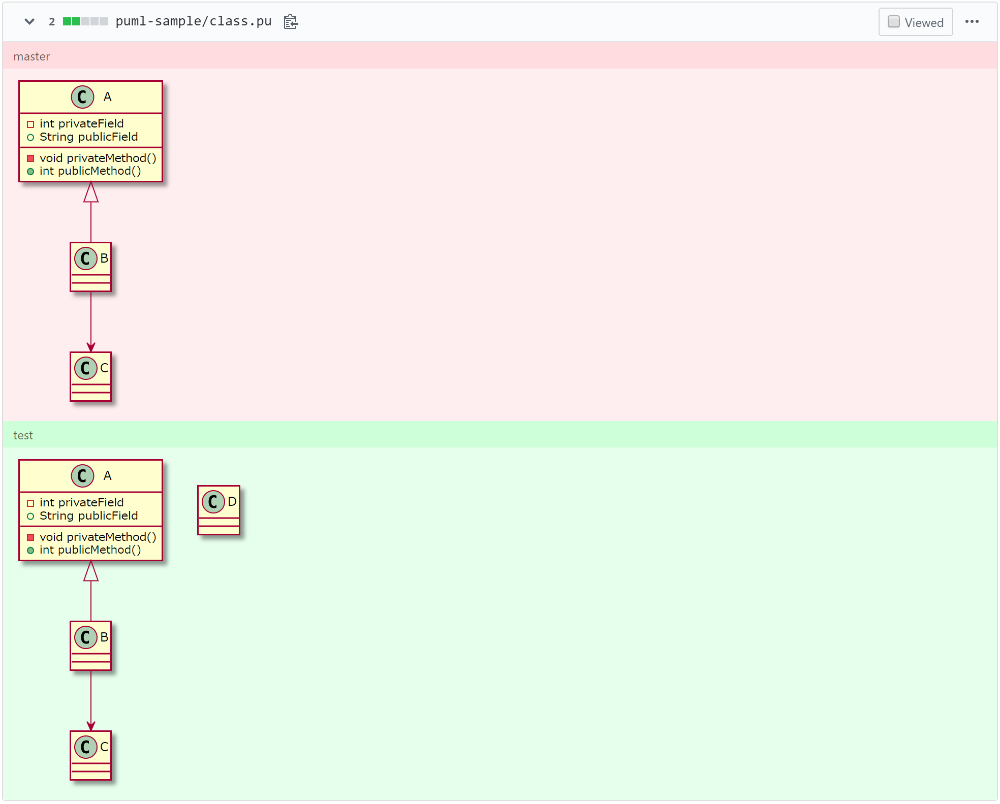
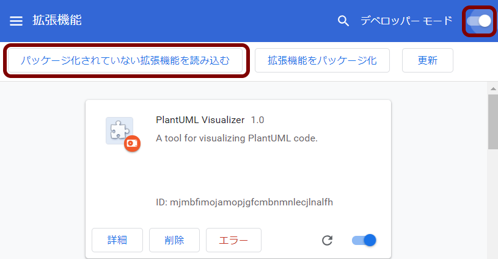

# PlantUML Visualizer

:factory: A Chrome / Firefox exntesion for visualizing PlantUML code.

## Release Pages

- Chrome: https://chrome.google.com/webstore/detail/plantuml-visualizer/ffaloebcmkogfdkemcekamlmfkkmgkcf
- Firefox: https://addons.mozilla.org/firefox/addon/plantuml-visualizer/

## Visualizable Pages

- GitHub
  - Code: https://github.com/WillBooster/plantuml-visualizer/blob/master/puml-sample/class.pu
  - Issues: https://github.com/WillBooster/plantuml-visualizer/issues/54
  - Pull Requests
    - Added: https://github.com/WillBooster/plantuml-visualizer/pull/49/files
    - Deleted: https://github.com/WillBooster/plantuml-visualizer/pull/50/files
    - Changed: https://github.com/WillBooster/plantuml-visualizer/pull/24/files
  - Code blocks in README or something
    - README.md: https://github.com/WillBooster/plantuml-visualizer
- Any .pu / .puml / .plantuml files
  - GitHub Raw File: https://raw.githubusercontent.com/WillBooster/plantuml-visualizer/master/puml-sample/class.pu

## Visualization Examples

The visualization result of https://github.com/WillBooster/plantuml-visualizer/pull/24/files is as follows.

## Development Preparation

1. `yarn` to install the latest dependencies
1. `yarn build`
1. Open Chrome browser
1. Open [chrome://extensions](chrome://extensions)
1. Enable `Developer Mode`
1. Click `Load Unpacked` and open `dist` directory (`plantuml-visualizer/dist`)

## Development

1. `yarn` to install the latest dependencies
1. Open Chrome
1. Rewrite some code files
1. `yarn build`
1. Close and Reopen Chrome browser (not only tabs)
   - or reload this extension in [chrome://extensions](chrome://extensions) and reload pages
1. Debug code
1. Go to `step 3`

## Deployment for Chrome

1. Bump version in `manifest.json` and `package.json`
1. `yarn package`
1. Open https://chrome.google.com/webstore/developer/dashboard
1. Upload `dist.zip`

## Deployment for Firefox

1. Bump version in `manifest.json` and `package.json`
1. `yarn package`
1. Open https://addons.mozilla.org/en-US/developers/addon/plantuml-visualizer/edit
1. Upload `dist.zip` file
