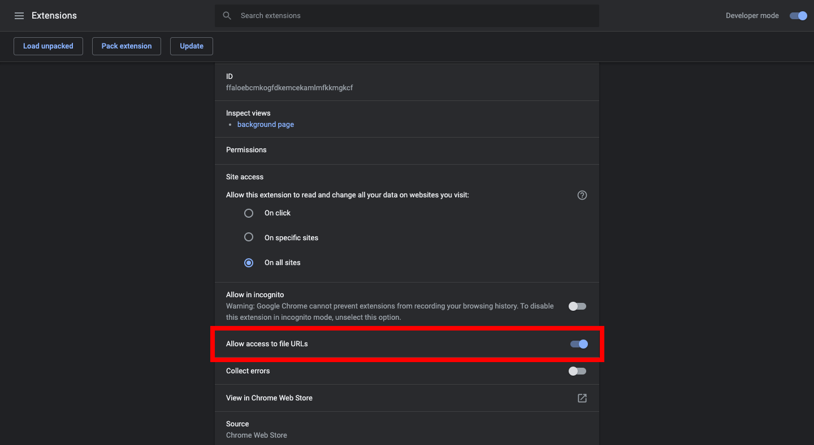
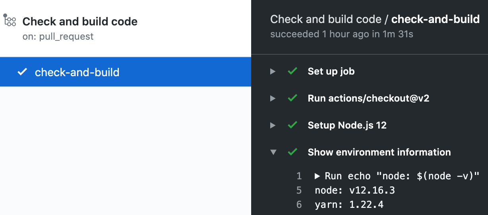

# PlantUML Visualizer

:factory: A Chrome / Firefox extension for visualizing PlantUML descriptions.

## Release Pages

- Chrome: https://chrome.google.com/webstore/detail/plantuml-visualizer/ffaloebcmkogfdkemcekamlmfkkmgkcf
- Firefox: https://addons.mozilla.org/firefox/addon/plantuml-visualizer/

## Visualizable Pages

### GitHub

- File Viewer
  - https://github.com/WillBooster/plantuml-visualizer/blob/master/puml-sample/class.pu
  - `!include` directive: https://github.com/WillBooster/plantuml-visualizer/blob/master/puml-sample/state.pu
- Issues: https://github.com/WillBooster/plantuml-visualizer/issues/54
- Pull Requests
  - Added: https://github.com/WillBooster/plantuml-visualizer/pull/49/files
  - Deleted: https://github.com/WillBooster/plantuml-visualizer/pull/50/files
  - Changed: https://github.com/WillBooster/plantuml-visualizer/pull/24/files
  - `!include` directive: https://github.com/WillBooster/plantuml-visualizer/pull/423/files
- Code blocks in README or something
  - README.md: https://github.com/WillBooster/plantuml-visualizer/blob/master/puml-sample/README.md

### GitLab

- Any page containing `<pre>` tag with prefix `@startuml` and suffix `@enduml`

(We will list webpages with testing urls later)

### .pu / .puml / .plantuml / .wsd files

- GitHub Raw Files (only Chrome)
  - https://raw.githubusercontent.com/WillBooster/plantuml-visualizer/master/puml-sample/class.pu
  - `!include` directive: https://raw.githubusercontent.com/WillBooster/plantuml-visualizer/master/puml-sample/state.pu
  - IMPORTANT NOTE: any extension on Firefox cannot work on GitHub Raw Files due to https://bugzilla.mozilla.org/show_bug.cgi?id=1411641
- Local Files
  - file:///C:/Users/XXX/Projects/plantuml-visualizer/puml-sample/class.pu
  - `!include` directive for local files will NOT be supported because of security problems
  - Please use another software for rich rendering of local files (e.g. the official PlantUML renderer: https://plantuml.com/en/starting)
  - IMPORTANT NOTE: if you use Google Chrome, you need to allow this extension to access file URLs
    1. Open chrome://extensions/?id=ffaloebcmkogfdkemcekamlmfkkmgkcf in Chrome
    2. Enable "Allow access to file URLs"
       

## Visualization Examples

The visualization result of https://github.com/WillBooster/plantuml-visualizer/pull/24/files is as follows.

## Default Vsualization Server

The default server is https://willbooster-plantuml.herokuapp.com
([source code](https://github.com/WillBooster/plantuml-service)).
You may check the PlantUML version via [this link](https://willbooster-plantuml.herokuapp.com/version).

You may use another **HTTPS** PlantUML server by changing settings in the configuration window.

## Requirements for Development

- [Node.js](https://nodejs.org/)
- [Yarn v1](https://classic.yarnpkg.com/)

Please check the detailed versions in [GitHub Actions](https://github.com/WillBooster/plantuml-visualizer/actions?query=workflow%3A%22Check+and+build+code%22) like the below screenshot.

## Development Preparation

1. `yarn` to install the latest dependencies
1. `yarn build`
1. Open Chrome browser
1. Open [chrome://extensions](chrome://extensions)
1. Enable `Developer Mode`
1. Click `Load Unpacked` and open `dist` directory (`plantuml-visualizer/dist`)

## Development

1. `yarn` to install the latest dependencies
1. `yarn start`
1. Open Chrome
1. Rewrite some code files
1. Close and Reopen Chrome browser (not only tabs)
   - or reload this extension in [chrome://extensions](chrome://extensions) and reload pages
1. Debug code
1. Go to `step 4`

## Deployment for Chrome

1. Bump version in `manifest.json` and `package.json`
1. `yarn package`
1. Open https://chrome.google.com/webstore/developer/dashboard
1. Upload `dist.zip`

## Deployment for Firefox

1. Bump version in `manifest.json` and `package.json`
1. `yarn package`
1. Open https://addons.mozilla.org/en-US/developers/addon/plantuml-visualizer/edit
1. Upload `dist.zip` file
